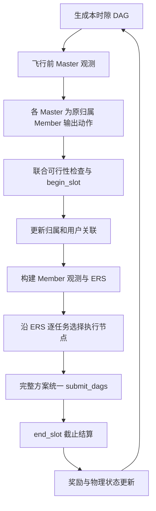

# Master–Member UAV 强化学习：文献调研与框架建议

日期：2026-09-04。状态：供讨论的研究方案，未实施策略或训练代码；其中项目事实以当前规范和实现为准。

## 1. 结论与适用前提

建议采用**两类策略、同类参数共享、集合/图表示、动态候选动作解码、集中训练与分布执行（CTDE）**的框架。第一版采用 PPO 的集中价值评估路线作为基线，后续比较 HARL/HAPPO 的异构协作优化。Member 层优先参考 GiPH 的动态设备放置问题，结合现有 ERS 顺序生成完整方案；Master 层为当前管理的每个 Member 输出二维动作。

这是根据多篇文献和项目约束提出的组合设计，不是某篇论文中已有算法的直接复现，也没有已验证的性能或收敛保证。

暂按“训练时可从仿真器取得全局状态，执行时严格限制信息范围”设计。该前提已向用户询问；若不成立，保留两个 actor 和动态集合接口，改用局部价值评估/分布式训练，并重新评估共享 BS 的协调方法。

本项目的“分层”目前指职责和决策阶段不同：Master 控制飞行，Member 决定放置；两层每时隙都工作。并不自动等同于具有 options、子目标或不同控制周期的经典层次强化学习。

## 2. 项目实际问题：变化的是哪些维度

依据当前 `specs/01_system_model.md`、`env/simulator.py`、`env/types.py`、`methods/components/ordering/ers.py` 和配置：

| 对象 | 已确定的项目语义 | 对算法设计的影响 |
|---|---|---|
| Master | 每区一架、位置固定、只输出 Member 飞行动作 | 每个 Master 的输出数量随归属集合变化 |
| Member | 可移动计算节点；执行卸载决策 | 自身身份固定，本地观察和候选节点集合变化 |
| 默认数量 | 4 个区域、4 个 Master、12 个 Member | 迁移不意味着全局智能体出生或消失 |
| 地面设备 | 默认 100 个；每时隙每用户一个 DAG；默认每 DAG 10 节点 | 默认每隙共 1000 个子任务，分配给各 Member 的数量可变 |
| 卸载候选 | 当前任务自己的 Ground、本区所有 Member、唯一 BS | 区内有 n 架 Member 时，每子任务有 n+2 个合法候选 |
| 决策时机 | 移动和归属更新后，全部放置先确定，整批提交 | Member 是构造式放置策略，不是任务就绪时再调度 |
| ERS | 已实现排序，不选择执行节点 | 第一版保留排序，只学放置 |
| 时隙状态 | 每隙新建通信/计算队列，截止未完成 DAG 失败 | 不使用虚构的跨隙任务积压；物理状态可跨隙延续 |
| 信息范围 | Master 本区完整信息及外区摘要；Member 自身、所属 DAG、本区候选资源 | actor 不能读取其他区域完整 DAG 或其他 Member 未共享的方案 |
| BS | 所有区域共用 | 不允许直接跨区卸载仍不等于区域间完全独立 |

令飞行前归属区域 r 的 Member 集合为 M_r(t)。Master 的动作是：

\[
A_r^M(t)=\{(i,u_i): i\in M_r(t),\ u_i\in[-1,1]^2\}.
\]

令 Member i 飞行后的归属为 r_i^+(t)，当前处理的子任务属于用户 g，则：

\[
\mathcal C_{i,g}(t)=\{\operatorname{Ground}(g)\}\cup
\{\operatorname{Member}(j):j\in M_{r_i^+}^+(t)\}\cup\{\operatorname{BS}(0)\}.
\]

迁移改变集合长度，不改变“每个 UAV 的特征含义”“每个任务节点的特征含义”“每个候选设备的评分函数”。因此网络权重维度可以固定，输入行数和输出行数可变。

严格建模时，可把全局状态定义成带类型实体的图，把不同大小的图纳入同一个状态空间，并将合法动作集合写成状态的函数。无需每次迁移重新定义一个 MDP 或重建网络。

## 3. 检索范围与证据等级

本次是面向架构决策的定向检索，不是穷尽式系统综述。检索覆盖基础方法和截至检索日期可见的 2025–2026 年相邻研究，主要主题如下：

- heterogeneous multi-agent reinforcement learning / HAPPO / MAPPO；
- variable team size / open ad hoc teamwork / graph policy learning；
- dynamic device clusters / DAG placement / graph reinforcement learning；
- pointer networks / invalid action masking / set transformer；
- multi-region UAV mobile edge computing / master-slave task offloading。

优先使用 MLSys、NeurIPS、PMLR、JMLR、IEEE、出版社原始页面和作者 arXiv 稿。学术 MCP 连接器本会话不可用；IEEE/OpenReview 的部分页面触发访问验证，部分出版社页面请求失败。此类论文仅使用可核验的原站摘要/元数据，明确标记，未将无法核验的细节作为设计依据。预印本与正式发表论文分开标注。

### 3.1 核心方法文献

| 文献及来源 | 核验范围 | 与项目的关系 | 不能直接照搬的部分 |
|---|---|---|---|
| **GiPH: Generalizable Placement Learning for Adaptive Heterogeneous Computing**，Hu 等，MLSys 2023，[正式论文](https://proceedings.mlsys.org/paper_files/paper/2023/hash/3e3eec95971350490e37a076fdc100ad-Abstract-mlsys2023.html) | 正式页面与全文方法 | 明确处理动态设备集群和 DAG 放置，是 Member 层最贴近的核心参考 | 原方法迭代改进已有放置；本项目首版按 ERS 构造放置，且有多个局部决策者 |
| **Heterogeneous-Agent Reinforcement Learning**，Zhong 等，JMLR 25(32), 2024，[论文](https://jmlr.org/papers/v25/23-0488.html) | 正式页面、摘要与公开 PDF | HARL/HAPPO 为不同策略的协作优化提供依据 | 不自动解决可变长度输入输出；更改为按类型共享参数后，不能直接继承原理论保证 |
| **The Surprising Effectiveness of PPO in Cooperative Multi-Agent Games**，Yu 等，NeurIPS 2022，[会议页面](https://nips.cc/virtual/2022/poster/55717)、[全文](https://arxiv.org/html/2103.01955v4) | 方法及参数共享说明 | 集中价值评估的 PPO 是值得先建立的合作基线 | 本项目的集合结构、连续飞行和长放置序列是额外设计，不是原基准的性能结论 |
| **Set Transformer: A Framework for Attention-based Permutation-Invariant Neural Networks**，Lee 等，ICML 2019，[论文](https://proceedings.mlr.press/v97/lee19d.html) | 正式页面、公开全文 | 为可变长度实体集合及实体间交互提供编码方法 | 集合编码本身不定义强化学习更新或合法动作 |
| **Pointer Networks**，Vinyals、Fortunato、Jaitly，NeurIPS 2015，[论文](https://proceedings.neurips.cc/paper/2015/hash/29921001f2f04bd3baee84a12e98098f-Abstract.html) | 正式页面与摘要 | 输出“指向当前候选中的一个”，适合候选数变化 | 原论文不是 UAV MARL；这里只借鉴候选选择机制 |
| **A Closer Look at Invalid Action Masking in Policy Gradient Algorithms**，Huang、Ontañón，FLAIRS 35, 2022，[论文](https://arxiv.org/abs/2006.14171)，DOI: 10.32473/flairs.v35i.130584 | 元数据与全文 | 支持对离散放置动作进行合法性屏蔽 | 不应把离散 mask 的结论直接用于多 UAV 连续联合飞行约束 |
| **Learning Scheduling Algorithms for Data Processing Clusters（Decima）**，Mao 等，SIGCOMM 2019，[全文](https://arxiv.org/html/1810.01963v4)，DOI: 10.1145/3341302.3342080 | 全文 §5.1–5.2 | DAG 表示和共享候选评分有借鉴意义 | 原文在可运行阶段变化时做调度；本项目全部节点在运行前完成放置 |
| **Learning Generalizable Device Placement Algorithms for Distributed Machine Learning（Placeto）**，Addanki 等，NeurIPS 2019，[论文](https://papers.neurips.cc/paper_files/paper/2019/hash/71560ce98c8250ce57a6a970c9991a5f-Abstract.html) | 正式页面与摘要 | 图表示与放置优化的前序工作 | 不能仅凭跨任务图泛化就声称支持动态设备集群 |
| **A General Learning Framework for Open Ad Hoc Teamwork Using Graph-based Policy Learning**，Rahman 等，JMLR 24(298), 2023，[论文](https://jmlr.org/papers/v24/22-099.html) | 正式页面与摘要 | 团队组成变化和局部可见性的相关研究 | 原任务侧重与未知队友协作；本项目能共同训练所有 Member，设定不同 |
| **Actor-Attention-Critic for Multi-Agent Reinforcement Learning（MAAC）**，Iqbal、Sha，ICML 2019，[论文](https://proceedings.mlr.press/v97/iqbal19a.html) | 正式页面与论文介绍 | 训练时注意力价值评估可关注相关智能体 | 首版可借鉴 critic 表示，不必切换到原文完整训练算法 |

### 3.2 相邻应用文献

| 文献及来源 | 相似处及证据范围 | 使用边界 |
|---|---|---|
| **Graph Reinforcement Learning Based Multi-Hotspot Region UAV Dynamic Scheduling in Mobile Edge Computing**，Zhao、Yang、Li，WCNC 2024，[IEEE](https://ieeexplore.ieee.org/document/10570642/)，DOI: 10.1109/WCNC57260.2024.10570642 | 原站可检索摘要描述图结构、PPO 和热点区域调度；全文未取得 | 场景相关，但尚不能确认是否支持本项目的双类策略和动态放置输出 |
| **Service Function Chain Scheduling in Heterogeneous Multi-UAV Edge Computing**，Wang 等，Drones 7(2), 132, 2023，[出版社](https://www.mdpi.com/2504-446X/7/2/132)，DOI: 10.3390/drones7020132 | 可检索出版社正文/摘要有 Master–Slave 结构和服务链放置 | 提出的核心求解方法是两阶段启发式；不能作为“双类 RL 已解决”的证据 |
| **MS_M2ATD3: A master-slave multi-agent reinforcement learning for energy-efficient task offloading in LEO satellite edge computing**，Chen 等，Ad Hoc Networks 178, 103987, 2025，[出版社](https://www.sciencedirect.com/science/article/pii/S1570870525002355)，DOI: 10.1016/j.adhoc.2025.103987 | 原站摘要明确服务器协调者和用户设备卸载策略 | 卫星/用户角色与本项目不同；摘要未证明可变维度支持 |
| **Two-Layer Reinforcement Learning-Assisted Joint Beamforming and Trajectory Optimization for Multi-UAV Downlink Communications**，Wang 等，2026，[作者预印本](https://arxiv.org/abs/2601.12659) | 全文：图模型处理动态关联，MAPPO 负责轨迹 | 本次按预印本引用；其轨迹动作是五个离散方向，低层是波束赋形，不是本项目的 DAG 放置 |

阅读优先级：**GiPH → HARL → MAPPO → Set Transformer / Pointer / Masking → Decima**。以上文献分别支撑问题表示、策略协作、训练基线与解码机制；没有一篇经本次核验的论文完整覆盖本项目全部约束。

## 4. 三条可选路线

| 路线 | 设计 | 优点 | 代价与用途 |
|---|---|---|---|
| A：固定上界 + padding/mask | 两类 PPO 策略；固定槽位编码实体与动作 | 当前总数固定，最容易建立可运行基线 | 对实体排列敏感；超出预设规模需调整；适合作为对照 |
| **B：集合/图策略 + 动态解码 + 集中价值评估 PPO** | Master 逐实体连续输出；Member 逐任务候选评分；同类共享参数 | 直接匹配迁移和 ERS；保持模型参数规模稳定 | 需明确序列概率、可见信息和阶段时间；推荐主线 |
| C：结构化策略 + HARL/HAPPO，或 GiPH 式放置改进 | 使用相同实体表示，增强协作更新或在提交前多轮搜索 | 可分别研究训练非平稳性和放置搜索质量 | 计算/实现成本较高；改变共享参数方式需重新核对理论；作为后续比较 |

不优先选择把所有子任务与设备组合压成一个大离散动作，也不优先把 Member 的离散节点选择转成 DDPG 连续值后取整。它们会引入额外的组合规模或概率语义问题。采用 GNN 也不意味着必须引入完整全局异构图；首版可以使用局部模块化编码。

## 5. 推荐网络设计

### 5.1 Master actor：集合输入，逐成员输出

每个 Master 使用同一个参数集合 theta_M，输入为自己的区域上下文和三类实体：

- 本区域 Member 集合：当前位置、相对位置、计算能力；能耗模块完成后加入剩余能量和能量虚拟队列。
- 本区域用户与本时隙 DAG：用户位置、计算/输入/边数据量、DAG 特征。Master 的当前任务观察发生在飞行前。
- 其他区域的允许摘要：区域几何信息、用户数、Member 数、任务负载和供需统计。实际动态摘要字段需要在环境观测契约中固定。

共享编码器将每个实体编码为固定宽度向量；集合注意力处理相互关系，池化形成区域上下文。**保留每个 Member 的独立表示**，然后用同一个动作头为每个 Member 生成二维分布参数：

\[
(\mu_i,\log\sigma_i)=f_{\theta_M}(h_i,c_r),\quad
z_i\sim\mathcal N(\mu_i,\operatorname{diag}(\sigma_i^2)),\quad u_i=\tanh(z_i).
\]

每个 Master 的输出形状为 n_r × 2；n_r 改变，编码器和动作头不变。环境根据全局 Member ID 汇总为现有仿真器需要的 M × 2 数组。

区域摘要应对集合排列不变；逐成员动作应对成员重排保持等变，即输入换序后对应输出同样换序。只将所有成员池化成一个向量后接固定长度动作头，不能自然满足后者。

第一版各 Member 动作在共享上下文下条件独立采样。这并不保证联合迁移约束，应由第 8 节处理；若后续需要更强相关动作，可比较自回归飞行动作头。

连续动作遵守当前“每个水平分量属于 [-1,1]”的约定。当前代码按分量乘最大速度，二维速度模长可能大于该参数；此时不能擅自改成单位圆。训练 log-prob 包含 tanh 变换校正，且记录策略提议的动作。

### 5.2 Member actor：DAG 编码 + 候选设备评分

所有 Member 使用同一参数集合 theta_m，不与 Master actor 共用输出头。某 Member 迁移后继续使用同一策略，无需根据目的区域重新训练或切换权重。

每个 Member 的局部输入分为：所属 DAG 的节点/边、当前 ERS 子任务、合法候选资源、自己已生成的放置前缀。

节点特征建议包括计算量、原始输入量、ERS rank、是否已放置；边特征包含中间结果量和依赖方向。保留 DAG 边，不能只对节点特征求平均。候选节点采用类型编码，至少区分 Ground、Member 和 BS。

对当前子任务 v 与每个候选 c 构造任务—设备特征 psi(v,c)，例如该任务在有效核心上的计算成本摘要、原始输入经 owner 中继的传输成本、已放置前驱到该候选的合法路径成本。对于多核设备，传输与排队不能被简单的“计算量/总频率”替代；未放置后继仍用 DAG 表示提供上下文。

\[
\ell_c=f_{\theta_m}(h_v,h_c,h_i,h_{\text{prefix}},\psi(v,c)),\quad
\pi_m(c\mid o_i,v,a_{<k})=
\frac{m_c\exp(\ell_c)}{\sum_{d\in\mathcal C}m_d\exp(\ell_d)}.
\]

其中 m_c 是合法性 mask；实现时对非法 logits 赋负无穷，再在有效项上 softmax。这样本区 2 架 Member 时输出 4 个候选概率，迁移后本区 5 架时输出 7 个，评分网络仍然相同。Pointer 提供输出形式，DAG/设备表示参考前述文献；具体组合与特征是本项目的设计建议。

沿现有 ERS 顺序处理全部子任务，更新自己已放置的前缀，最终返回 TaskKey → EntityRef 的完整映射。**选择动作时不要求子任务数据就绪，不推进真实事件时间，也不触发部分方案提交。**

前缀应包含已分配到各设备的工作量、前驱位置等自身可知信息，防止一批任务盲目集中到同一设备。它是“规划中的放置状态”，不是正在执行的真实队列；第一版不要求精确预测其他 Member 的同时决策。

任务—候选交叉评分只在当前任务上计算，可避免一开始建立所有任务与所有设备的稠密积图。完整 gpNet 或放置局部搜索适合作为后续增强，而非首版必选条件。

### 5.3 Critic 与信息隔离

训练阶段可以建立全局集合/图 critic，包含区域、Member、任务以及唯一 BS；采用飞行前与飞行后/放置阶段的不同价值头或显式阶段编码。Member 的价值基线可加入自身放置前缀，以降低长序列估计方差。

actor 必须通过独立的只读局部观测构建器取得数据。尤其不能先把全局任务信息在共享图中传播到 Member 向量，再声称只读取该向量就是分布执行。注意力 mask 要约束实际信息传播路径；集中 critic 的中间向量不能回流成为部署 actor 的输入。

BS 的静态资源和允许公开的当期信息可以作为候选特征；不向 actor 暴露其他区域尚未提交的完整方案。共享 BS 的跨区域竞争由训练奖励与 critic 处理。若需要部署时的预约摘要，属于另行定义的通信机制。

同区域不同 Member 之间的详细 DAG/前缀共享也不属于当前默认可见范围；不能因为“局部图”一词就把全区域任务都交给 Member。

## 6. 决策时序与训练样本

### 6.1 一个物理时隙

Master t 时隙的动作由飞行前的归属决定；目的区域 Master 不得在同一时隙给迁入 UAV 再发一次飞行动作。Member 的 t 时隙调度观察已经使用飞行后区域，下一时隙飞行才由新 Master 控制。

Member 迁移不设置 terminated，不重置其物理 ID，也不删除已采集轨迹。区域内临时索引只用于打包；日志和动作映射保留全局 EntityRef、TaskKey、时隙编号和当时归属。若后续引入跨隙记忆，记忆按物理 Member ID 关联；每隙放置解码器的前缀则正常清空。

### 6.2 推荐：把放置解码展开成零物理时间的内部决策

默认每时隙已有约 1000 个子任务，直接把一个 Member 的所有放置看成单个巨大动作，会产生很长的联合概率乘积。建议保留对外的完整方案接口，在训练器内部显式记录构造过程。

扩展状态包含 `(slot_id, phase, next_decision, partial_placements)`；Member 的每次选择是一个内部动作。不同 Member 之间用确定性的轮转顺序记录，保持各自 ERS 次序。此序列只定义采样和训练顺序，不授权后行动者读取先行动者的私有方案，也不改变统一提交时的运行时 ERS。策略不依赖其他 Member 的前缀时，这种序列化可表示其独立的整批采样。

时钟和奖励约定：

- Master 飞行到 Member 规划、以及子任务之间的规划转换，不推进 DAG 事件时间，内部折扣设为 1。
- 只有全部位置确定、运行时完成一个真实调度窗口后，发放一次时隙奖励，并对跨时隙回报使用 gamma。
- 不把同一时隙奖励复制到每个子任务；否则任务更多的轨迹会被重复累计奖励。
- 若使用 GAE，必须显式使用每个转换的折扣 d_j。内部转换的 trace 衰减建议为 1，物理时隙转换才使用 lambda，避免仅因 DAG 节点多就额外衰减信用。

即：

\[
\delta_j=r_j+d_jV(s_{j+1})-V(s_j),\qquad
\hat A_j=\delta_j+d_j\lambda_j\hat A_{j+1}.
\]

内部转换取 `(r_j,d_j,lambda_j)=(0,1,1)`；时隙结算转换取 `(r_t,gamma,lambda)`，真正终止时取消 bootstrap。训练批次截断但环境未终止时保留 bootstrap。critic 的阶段输入必须与实际下一状态一致，不能把 Member 的“下一状态”直接当成还没发生飞行的下一 Member 观察。

Master 的一条区域动作包含 n_r 个二维分量，区域动作 log-prob 是有效分量 log-prob 之和；Member 内部动作是一个 categorical 选择，按该步历史和 mask 计算 PPO ratio。此实现是对展开决策过程的结构化 PPO，不能把其 clipping 描述为“整个放置方案联合 ratio 的严格等价形式”。

另一种完整方案 PPO 的正确联合概率是：

\[
\log\pi(A_i\mid o_i)=\sum_{k=1}^{K_i}\log\pi(a_{i,k}\mid o_i,a_{i,<k}).
\]

它可作为比较，但不能用平均 log-prob 替代该和式。长序列可能导致 ratio 很快偏离 1，应检查 KL、clip fraction 和解码长度；不能悄悄取几何平均再声称目标未变。

初始训练可使用较少 PPO epoch、KL 提前停止和按类型分别控制 actor 学习率。Master 与 Member 的损失分开记录。以每个时隙内有效决策项求和、再对时隙取均值定义 Member 目标；若按任务数重加权或按 Member 等权，须作为显式优化选择和消融，而非无意间由 padding 数量决定。

### 6.3 Batch 与 mask

集合网络在批处理中仍然可以 padding；“使用 padding”与“支持可变集合”不矛盾。需区分：实体 mask（真实行）、候选 mask（合法设备）、决策 mask（当前是否需要 actor 输出）、bootstrap/终止标记。

每条样本保存当时的候选 EntityRef 列表、合法性 mask、动作索引、旧 log-prob、必要前缀和阶段。更新时重放该样本的候选与前缀，不使用 UAV 后来迁移后的候选集合。前缀必须用采样时真实采取的动作重建，不能在训练时重新采样。

没有所属任务的 Member 输出空方案并跳过 actor 损失，仍保留其作为计算候选和未来可决策实体的身份。Padding 行不参与 attention、概率、entropy、loss 或归一化统计。若有效候选只有一个，则动作确定、entropy 为零；若为零则是观测/合法性错误，不对全负无穷 logits 做 softmax。

## 7. 奖励与长期目标

第一版建议采用两类智能体共享的团队奖励，先避免 Master 把负载外推到邻区、Member 把任务集中到 BS 后只优化自身收益。区域奖励、差分奖励和局部信用分配后续单独比较，不直接混入基线。

对本时隙 N_t 个生成 DAG，窗口长度 H，定义：

\[
D_t=\frac1{N_t}\sum_g\begin{cases}
(C_g-t_{start})/H,&g\text{ 完成},\\
1,&g\text{ 截止未完成},
\end{cases}\qquad
F_t=\frac{N_{failed}}{N_t}.
\]

失败时的 1 是训练目标中的截断时延代价，不是声称该 DAG 实际恰好 H 秒完成。不能只统计成功 DAG 的平均时延，否则可能通过放弃慢任务获得虚假的改善。奖励起点为：

\[
r_t=-\alpha D_t-\beta F_t-\eta E_t^{norm}
-\kappa B_t-\xi U_t.
\]

E_t 是 Member 的飞行/悬停、发送与计算能耗，经固定参考量归一化；B_t 是按 Member 数归一化的地图边界违规数；U_t 是联合迁移导致服务区域失去 Member 的提议违规指标。系数均为待实验选择的设计参数，应报告原始多目标指标及权重敏感性，而非只报告总 reward。该加权式不保证严格“失败率优先”的字典序目标；若失败率有硬目标，应改为约束目标。

**现有能力限制：** `SlotResult` 只有所有实体的计算/发送能耗总量，并非按 Member 分解；飞行能耗与电池状态也未接入。因此首个调度实验可以令 eta=0，只声称优化时延与失败率。要启用能耗目标，需先补齐按 EntityRef 的能耗分解，避免把 Ground 上传、BS 计算等能耗错误计入 UAV 电池；局部虚拟队列更不能使用全局总能耗代替。

如研究目标包含长期平均 UAV 能耗预算，可在完成逐 UAV 计量后设计：

\[
Q_i(t+1)=\max(0,Q_i(t)+E_i(t)-\bar E_i).
\]

把 Q_i 纳入观测，并比较固定能耗惩罚与 Q_i 加权代价。这是可选的约束控制扩展：Q_i 是预算欠账，不是电池电量；引入该更新也不自动得到队列稳定性或约束满足保证。配置中的 145 J/slot 需要确定为平均预算、每隙硬约束还是其他含义后再使用。

队列清空并不使整体问题失去长期性：Master 位置/迁移的影响跨隙持续，完整方案还应考虑电池/预算状态。Member 在固定拓扑且没有跨隙能量状态的简化实验中，主要是每隙的组合优化；不要为了使用 RL 而额外添加不存在的任务积压。

## 8. 训练前要解决的环境边界

### 8.1 迁空区域

当前 `Simulator.refresh_slot_topology()` 遇到有用户但无 Member 的区域会抛出异常；`begin_slot()` 会恢复物理状态。这是现有保护行为，但还不是训练需要的“下一状态 + 惩罚”。

建议首版保持“有用户区域至少一架 Member”的服务约束。在飞行提议进入仿真器前，按现有地图边界规则计算全部候选位置，再检查飞行后的区域计数。若有服务区域被迁空，**首个基线可拒绝整个飞行批次、执行零动作并附加 U_t 惩罚**，以获得简单确定、可验证的转换。它会拒绝部分原本合法的动作，需统计拒绝率，不能把它描述为现有逐 UAV 地图越界规则。

后续可以用逐迁移准入、保留必要离开者等更细规则替换，并单独比较。独立检查“每架 UAV 都可离开”不够：两架都认为另一个会留下时仍可能一起迁空。若未来允许无 UAV 区域直接本地执行，则需要同时定义这些用户的 DAG 由谁产生放置、如何结算，属于系统模型扩展。

训练记录原始提议、实际执行和拒绝原因。确定性拒绝属于环境动作到结果的映射，PPO 对提议动作计算 log-prob；不能把执行后的零动作当成策略采样的原动作。

### 8.2 规划期观察

全部放置尚未提交时，真实当期服务器和信道队列起初为空。不能用已运行完整方案得到的未来排队状态作为该方案的 actor 输入。如果增加规划器内的预测负载，只依赖合法可见状态及已知前缀，并标明它是估算。

### 8.3 DAG 结算完整性

奖励分母使用所有本时隙生成的 DAG，而非只用已提交者。环境适配层须验证每个应提交任务恰好有一个合法放置，不能让漏交任务从失败率分母中消失。调度窗口截止失败是 DAG 的结果，不等于 Member 智能体终止。

### 8.4 规模与信息泛化

网络能够接收新的 n_r 只证明接口支持，并不证明在未见过的规模上有好性能。训练要覆盖不均衡区域、成员聚集/迁移、不同用户负载和设备候选顺序；测试单独报告分布内和未见规模表现。完整全局注意力可能随任务数平方增长，默认 1000 个节点时优先按 DAG 编码、再做层级摘要，而不是将所有节点密集相连。

## 9. 建议实验顺序与比较

| 阶段 | 内容 | 要回答的问题 |
|---|---|---|
| 1 | 固定 UAV 位置，保留 ERS，只训练 Member | 候选评分能否学到比固定卸载规则更好的放置？ |
| 2 | 使用可行的受控迁移，覆盖多种区域成员数 | 迁移后 ID、候选、mask 和完整方案是否始终正确？ |
| 3 | 固定一个已训练 Member 策略，训练 Master | 飞行/负载重分配是否带来独立收益？ |
| 4 | 两类策略共同训练，小幅更新；每次用当前策略重新采样 | 联合训练能否超过分阶段结果，而不是相互破坏？ |
| 5 | 加入已核验的能耗和预算模型 | 时延、失败率、能耗之间的权衡是否符合目标？ |
| 6 | 同等交互/搜索预算下比较 HAPPO 或 GiPH 式改进 | 收益来自策略结构、更新方式，还是更多计算？ |

对照方法应共享同一个仿真器、ERS、截止规则、迁移约束和测试实例：全本地、全 owner、合法的 BS 卸载规则、ERS + 成本贪心、固定槽位两类 PPO、集合/图两类 PPO。成本贪心的队列估计必须注明；使用近似成本或当前 ERS 的改写时称为 HEFT 风格，不声称完整复现原始 HEFT。

重点消融：去掉 DAG 边、去掉放置前缀、集合编码换固定槽位、集中 critic 换局部 critic、禁止迁移、移除外区摘要。合法性 mask 保持环境约束；若比较惩罚式非法动作处理，需要定义统一的无效动作转换，不能靠训练时崩溃体现差异。

指标至少包括：全部 DAG 的失败率、成功 DAG 时延（明确条件统计）、截断时延代价 D_t、各区域失败率、BS 利用/拥塞指标、飞行越界/迁空拒绝率、推理耗时、有效子任务数和候选数量。能耗模块就绪后加入逐 UAV/总 UAV 能耗、预算超出量和虚拟队列轨迹。

建议使用至少 5 个独立训练种子，并在共同的留出场景上报告均值与离散程度。分开记录环境交互数量、梯度更新数量和总运行时间。区域成员数变化可首先在固定 12 架总数下测试，再把总数 8/16 等作为额外规模泛化场景；DAG 节点数和用户数变化同理。

提交实现前的语义验证包括：候选重排后概率随候选正确重排；成员重排后飞行动作等变；跨区不重置身份；padding 不影响合法概率；空任务 Member 不制造伪动作；存储的候选和 mask 可准确重放旧 log-prob；内部决策不推进时钟、不重复奖励；Actor 不读取不可见信息；每个生成 DAG 都进入结算。

## 10. 代码落点与讨论边界

当前 `env/mdp/` 已预留问题定义位置，适合放置阶段状态、局部观测、候选动作、奖励和仿真器适配；策略网络、rollout 与训练算法保留在方法/训练侧。`Simulator` 继续负责唯一的物理状态修改和运行时生命周期。

需要复用的正式接口是 `Simulator.begin_slot/end_slot`、`ERS(runtime).plan(requests)`、`SchedulingRuntime.submit_dags(...)`。`methods/contracts.py` 的旧单 DAG 协议不应强行限制新的 Member 批量放置接口。

当前最影响后续方案定稿的前提是 CTDE 是否允许；其次是能量预算含义和无 Member 区域的业务规则。本文已给出可运行基线的默认选择，未将它们伪装成用户已经确认的项目规则。

下一步应据本文确定观测/动作与训练时间契约，再进入实现。检索与设计本身不能证明新方法具有论文创新性；应在动态成员、跨区泛化、受限信息和共享 BS 耦合实验中验证相对已有方法的实质收益。
